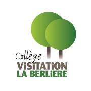

# DNL E.P.S. pour le niveau terminale
## **Mobilité ERASMUS+ Belgique** 
### *Présentation du projet*
1. Wallons-Bretons, bougeons ensemble ! {width=20%}  
   
3. Notre partenaire {width=15%}  
4. La mobilité
5. Thématiques étudiées

